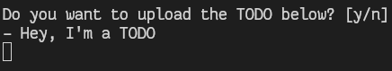

# TodoScanner
🖨️ Do you have TODOs comments in your project files? Turn them into issues.

## Description

TodoScanner will scan all your files and folders recursively looking for TODO comments, don't worry it is
very language agnostic. So, when it finds all of your TODOs, it will ask you if you want to upload it on
your GitHub repository as an issue.

## Installation

Soon.

## Usage

Soon.

## License
This project is licensed under the MIT License. See [LICENSE](./LICENSE).
